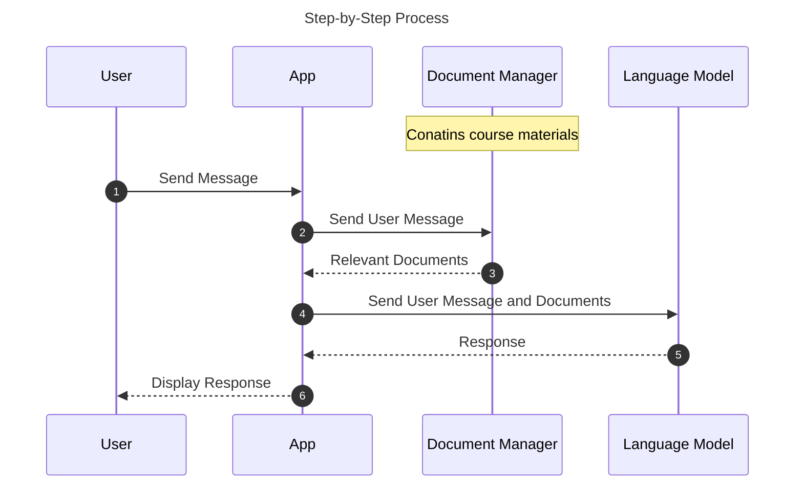

# Eidos

Eidos is a web app designed to facilitate learning in philosophy through AI-driven Socratic dialogue. Its objective is to make philosophical education more interactive and personalized, encouraging deep understanding and critical thinking. The app utilizes technologies such as a large language model for generating dialogue, a vector database for course materials, and user customization features for a tailored learning experience.

