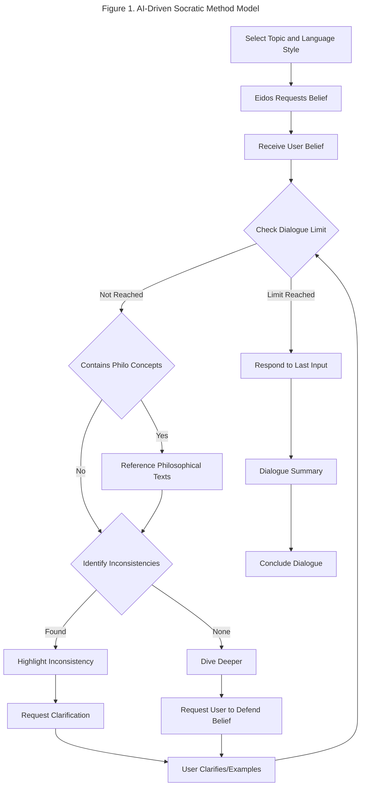

# Eidos: Examining Beliefs Through Dialogue

## Problem Statement

Many individuals hold beliefs without fully examining their foundations or considering alternative viewpoints. This lack of critical examination can lead to inconsistencies in thought, hindering personal growth and understanding. Traditional methods of learning often do not provide the personalized, interactive feedback necessary for deep philosophical inquiry.

## Proposed Solution

Eidos is a web application designed to engage users in a dialogue using the Socratic method. This approach encourages users to articulate their beliefs, confront inconsistencies, and consider alternative perspectives. By simulating a personalized philosophical conversation, Eidos aims to deepen the user's understanding and refine their beliefs.

## Key Features

- Engages users in deep discussions to explore their beliefs.
- Helps find and reflect on any inconsistencies in their beliefs.
- Introduces other viewpoints for comparison.
- Adapts conversations to individual user responses.
- Uses philosophical texts for factual references.

## Socratic Method Model

The AI-driven Socratic method model in Eidos follows a structured process:

1. **Request Belief**: The dialogue begins with the AI asking the user to state a belief.
2. **Receive User Belief**: The user shares their belief, initiating the dialogue.
3. **Check Dialogue Limit**: Ensures dialogues remain focused and concise.
   - **Not Reached**: Continues the dialogue by referencing philosophical texts to identify inconsistencies.
   - **Limit Reached**: Concludes the dialogue with a summary and suggestions for further reading.
4. **Identify Inconsistencies**: The AI identifies any inconsistencies in the user's belief by referencing philosophical texts.
   - **Found**: Provides contextual information and asks the user to clarify or provide examples.
   - **None**: Dives deeper into the topic by suggesting alternative perspectives and asking the user to defend their belief.
