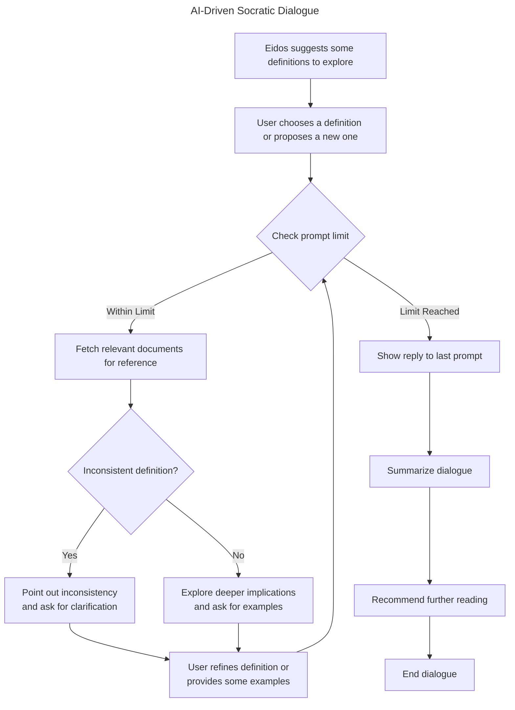

# Eidos

Eidos is a web app designed to facilitate learning in philosophy through AI-driven Socratic dialogue. The ambition is to make the study of philosophy more accessible, interactive, and reflective. This app utilizes technologies such as a large language model for generating responses, a vector database of publicly-available philosophy texts for reference, and customization features for a personalized user experience.

