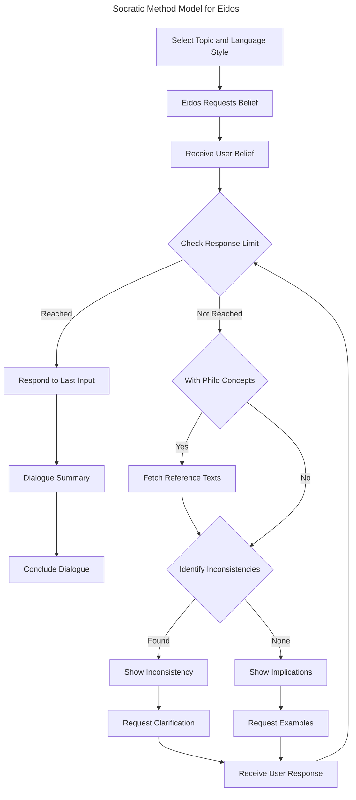
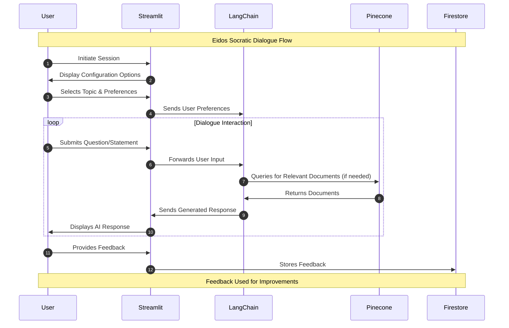

# Enhancing Philosophical Inquiry with AI-Driven Socratic Dialogues

## Abstract

Eidos is a web application developed to engage students in philosophical inquiry through AI-driven Socratic dialogues. This study evaluates Eidos' effectiveness in encouraging students to examine their beliefs and explore alternative perspectives. The development of Eidos centered around using a large language model to facilitate conversations that simulate the Socratic questioning technique. The application integrates a database of philosophical texts to avoid sharing unsupported claims and instead provide accurate and reliable information.

The evaluation involved high school and college students who provided feedback through a mixed-methods approach, including Likert-scale, multiple-choice questions, and open-ended responses. This assessment focused on Eidos' impact on students' critical thinking skills and openness to different viewpoints. Results showed a strong positive reception among students, who appreciated the dialogues for enhancing their ability to engage with their beliefs carefully. Participants also emphasized how they became more reflective on the foundations of their beliefs after using Eidos. However, feedback also highlighted the need to improve the Eidos' ability to handle complex beliefs and sensitive topics.

The findings suggest that Eidos has significant potential to enhance philosophical education by adapting to diverse student backgrounds, making philosophical inquiry accessible and engaging for all. The study also underscores the importance of refining AI capabilities to complement the efforts made by educators.

## Introduction

### The Socratic Method in Education

The Socratic method is a dialectical approach to inquiry that follows a question-and-answer format (Soccio 104). Demonstrated by Socrates in Plato's dialogues, this method was a tool for engaging Athenians to challenge their own beliefs. It aims to assess the coherence and support of a belief system (Benson 6). The process generally involves three steps: first, the individual presents a belief; then, Socrates asks questions to examine the belief's depth and implications; finally, both parties refine the belief to achieve a justified and coherent understanding. This iterative questioning and refining process encourages individuals to not just hold beliefs but to understand the reasoning behind them.

Employing the method has proven to significantly enhance critical thinking skills in diverse educational settings. For example, Socratic seminars provide students with a platform for intellectual analysis to avoid taking statements at face value (Acim 49). The method's focus on logic and clarity further improves analytical abilities when combined with practical learning exercises (Ho et al. 14). It has also been shown to boost communication skills, making students more confident in expressing their thoughts (Dalim et al. 1039). In addition, it was found that students value thought-provoking questions more than teachers realize, suggesting that the Socratic method should not be abandoned (Abou-Hanna et al. 114). All of these findings highlight the method's role in encouraging learners to question assumptions and engage deeply with content.

However, applying the Socratic method in different educational settings presents challenges. For instance, in language teaching and science education, obstacles such as teachers' lack of content knowledge and questioning skills have been identified (Dalim et al., 1040). These challenges underline the importance of professional training for teachers to effectively use the Socratic method. Without skilled teachers, students may feel intimidated that they resist learning (Crogman 70). Additionally, extra support must be provided as the method's success partly depends on the students' background knowledge and vocabulary (Copelin 4-5; Chan & Zahar 8). When thoughtfully applied, the Socratic method has the power to transform learning experiences.

### Overcoming Limitations through Artificial Intelligence

Eidos innovates artificial intelligence (AI) to enhance the Socratic method's application in education. This tool is crafted to complement teachers by adapting to diverse student backgrounds, ultimately aiming to make philosophical inquiry accessible and engaging for all. Eidos addresses three challenges: it uses natural language processing (NLP) to generate relevant responses, overcoming limitations in teachers' questioning skills; it offers customization options to cater to individual learning preferences, ensuring a broader inclusivity; and it uses a structured approach to identify inconsistencies in students' beliefs, promoting critical thinking and self-reflection. Through these measures, Eidos provides a platform where students can prepare to tackle the modern world through philosophical inquiry.

At the core of Eidos is OpenAI's GPT-4, a large language model (LLM) that excels in generating context-aware, human-like text. This technology is made possible by recent advancements in NLP that allow LLMs to understand nuanced language patterns (Devlin 2; Vaswani 5). Its proficiency in various NLP tasks such as question-answering and information extraction makes it a powerful tool for educational applications (Kalyan 13, 26; Dijkstra 4; MacNeil 37). Additionally, GPT-4's knowledge from its extensive training data allows it to identify internal contradictions and logical fallacies in students' claims, providing opportunity to improve their logical coherence. However, its limitations, such as reasoning errors and producing inaccurate content, require further solutions from Eidos (Achiam et al. 46).

Prompt engineering, a technique in using LLMs, is embraced to fine-tune Eidos' behavior. This technique provides the LLM with the most appropriate instruction for solving the task at hand (Liu et al. 22). By prompting the LLM to generate responses in a step-by-step manner, Eidos can mitigate the risk of making reasoning errors. Prompt engineering is also applied to adapt Eidos' questioning style with the students' learning preferences. For example, LLMs can be prompted to generate responses that uses standard English instead of academic-level language to cater to students with different language proficiency levels. Effective adoption of this technique requires experimentation with different prompt patterns such as role playing, chain-of-thought, and template filling (White et al., 4).

The tendency of LLMs to provide false information is addressed by retrieval-augmented generation (RAG), a technique that bridges knowledge gap by incorporating a database of external information (Gao et al. 2). In Eidos, publicly available articles from the Stanford Encyclopedia of Philosophy (SEP) is used to ground the factuality of the LLM's responses. This approach allows the model to avoid sharing unsupported claims and instead provide accurate and reliable information. Furthermore, Eidos cross-references the user's belief with the SEP articles to identify external contradictions to established philosophical knowledge. This process ensures that the user's belief is consistent with commonly accepted truths and encourages them to refine their understanding.

The subsequent sections of this paper will detail the design, development, and evaluation of Eidos, providing an in-depth analysis of its methodology and application. By addressing the design choices, development processes, and evaluation methods, this examination aims to illuminate the transformative potential of Eidos in overcoming the traditional challenges associated with the Socratic method. The significance of this study lies not only in its immediate impact on enhancing educational technology but also in its broader implications for the future of philosophical inquiry, offering a forward-looking perspective on how technology can enrich critical thinking and dialogic learning in the digital age.

## Methods

### Modelling the Socratic Method

Formal models for integrating the Socratic Method into computational systems have been explored, highlighting its use in developing dialogue systems. One study Caminada aims to formalize argumentations similar to the Socratic method, where the objective is to derive contradictions from an opponent's premises (Camida 111). Another approach uses state diagrams to formalize the method into three steps: eliciting examples, identifying attributes, and abstracting these into general principles (Huse & Le 184-188). While Eidos also uses state diagrams to formalize the Socratic method, it diverges by focusing on detecting inconsistencies within a belief statement.

The formal model for implementing Eidos outlines a structured process that uses AI to simulate Socratic dialogues. Before initiating the dialogue, the user selects a topic and language style to personalize the conversation. Eidos then requests the user to state a belief, which serves as the starting point for the dialogue. The system processes the user's input to determine if it contains philosophical concepts. If it does, Eidos references a database of SEP articles to ground the discussion in established knowledge. This retrieval-augmented generation (RAG) technique ensures that the dialogue is informed by credible sources.

After determining whether to fetch external references, Eidos identifies inconsistencies within the user's belief statement. If inconsistencies are found, the system highlights them to the user and requests clarification or examples to resolve the contradictions. An inconsistency is determined using three criteria: internal contradiction, logical fallacy, and factual inaccuracy. The first two are detected by the AI model's reasoning capabilities, while the third is cross-referenced with the SEP database. This iterative process of questioning and clarifying continues until a dialogue limit is reached, at which point Eidos provides a summary of the dialogue and concludes the session. A limit is set considering the expense of computational resources and the user's attention span.

The dialogue management leverages state machine concepts, where the dialogue progresses through a series of states (e.g., receiving beliefs, checking for philosophical concepts, identifying inconsistencies) based on the user's input and the system's assessments. This structured approach facilitates a focused and coherent exploration of beliefs, mimicking the iterative, deep-diving nature of the Socratic method.

### System Architecture

The Eidos system architecture uses a combination of Python libraries to create a web application focused on facilitating AI-driven Socratic dialogues. Each of these components plays a crucial role in the application's operation, from managing the user interface to processing dialogue and managing data.

#### LangChain Orchestrates Dialogue Flow

LangChain is a framework for developing applications that uses LLMs. It provides helpful abstractions for chat history, retrieving documents, prompt templates, combining LLMs together, and other functionalities (Topsakal and Akinci 1051-1054). In Eidos, LangChain is heavily used to orchestrate different instances of GPT-4 that performs various tasks such as deciding which dialogue path to pursue, cross-referencing belief statements with SEP articles, and, most importantly, generating final responses to the user's input. The application also benefits from LangChain's ability to manage chat history, considering that LLMs are stateless and require the list of previous interactions to generate context-aware responses.

#### Streamlit Deploys the Web Application

Streamlit enables rapid prototyping and deployment of data-driven applications such as Eidos. It handles user inputs, displays the AI-generated dialogues, and navigates between different pages of the application. Among its features, Eidos benefits from Streamlit's multipage support, allowing for a structured user interface that reduces information overload and confusion. Eidos has basically three pages: the configuration, where users select a conversation topic and language style; the chat interface, where the dialogues take place; and the feedback form, where users can provide their thoughts on the experience. Even though the application is limited with the components Streamlit provides, it is sufficient for the current version of Eidos.

#### Pinecone Stores and Retrieves Documents

Pinecone is a vector database that stores and retrieves documents based on their semantic similarity. The database is pre-populated with SEP articles, which are indexed using embeddings generated by OpenAI's language models to represent the semantic content of each document. During a dialogue, Pinecone performs queries derived from user inputs and the AI's responses. Relevant documents are retrieved and used to ground the conversation in established philosophical knowledge. Streamlit complements Pinecone by showing the retrieved documents to the user, providing additional context for the dialogue.

#### Firestore Manages User Feedback

Firestore is a flexible, scalable database from Firebase for mobile, web, and server development. It is used in Eidos to collect and store user feedback and dialogue history, supporting continuous improvement of the application based on real-world usage. At the end of a dialogue session, users are invited to complete a survey. Responses are collected and stored in Firestore, allowing for analysis of user experience, satisfaction, and areas for improvement. Firestore can also store records of dialogues, including user inputs and AI responses. This data can be used for analyzing engagement, identifying common topics of interest, and refining the AI's performance.

### Evaluation Design

The evaluation of Eidos aimed to measure its effectiveness in promoting philosophical inquiry among 250 high school and college students. Participants were prompted to complete a post-engagement survey, which included Likert-scale questions, multiple-choice questions, and open-ended responses. This survey methodology enabled the immediate capture of participants' impressions and interactions with Eidos, supplemented by the collection of chat history for qualitative analysis.

The survey questions assessed various aspects of participants' experiences, including the effectiveness of Eidos in encouraging critical examination of beliefs, openness to alternative perspectives, and identification of inconsistencies. Participants also provided feedback on the most valuable aspects of Eidos, changes in their approach to examining beliefs, and areas for improvement. Additionally, open-ended responses allowed participants to offer detailed insights and suggestions for enhancing the application's functionality. Quantitative analysis of Likert-scale and multiple-choice responses provided insights into the perceived effectiveness of Eidos, while qualitative analysis of open-ended responses and chat history facilitated a deeper understanding of participants' experiences and perspectives.

Throughout the evaluation process, ethical considerations were prioritized, with measures implemented to ensure participant confidentiality, obtain informed consent, and handle sensitive topics delicately. While the evaluation methodology was robust, limitations such as reliance on self-reported measures and potential biases in participant responses were acknowledged. Future research directions may involve exploring the long-term effects of Eidos, addressing identified areas for improvement, and expanding demographic diversity in participant selection to enhance the generalizability of findings.

## Results and Discussion

### Likert-Scale Responses

The feedback from high school and college students on Eidos demonstrates its significant effectiveness in promoting critical thinking and openness to diverse perspectives. The majority of participants reported a positive impact on their ability to critically examine beliefs and consider alternative viewpoints, highlighting Eidos' potential in philosophical education. However, a notable minority expressed concerns over the application's performance in identifying inconsistencies within their beliefs, pointing to a critical area for enhancement.

1. Effective in helping me examine my beliefs more critically

   |                   | High School | College | Total |
   | ----------------- | ----------- | ------- | ----- |
   | Strongly Agree    | 79          | 111     | 190   |
   | Agree             | 27          | 29      | 56    |
   | Disagree          | 1           | 0       | 1     |
   | Strongly Disagree | 0           | 3       | 3     |

2. Made me more open to considering alternative perspectives

   |                   | High School | College | Total |
   | ----------------- | ----------- | ------- | ----- |
   | Strongly Agree    | 93          | 113     | 206   |
   | Agree             | 12          | 27      | 39    |
   | Disagree          | 0           | 1       | 1     |
   | Strongly Disagree | 2           | 2       | 4     |

3. Clearly identified inconsistencies in my beliefs

   |                   | High School | College | Total |
   | ----------------- | ----------- | ------- | ----- |
   | Strongly Agree    | 76          | 115     | 191   |
   | Agree             | 24          | 22      | 46    |
   | Disagree          | 7           | 2       | 9     |
   | Strongly Disagree | 0           | 4       | 4     |

Eidos has shown to significantly impact students' approach to philosophical inquiry, as evidenced by the high levels of agreement on its effectiveness. The primary challenge identified involves refining the AI’s reasoning abilities and enhancing dialogue management to better tackle the complexities of personal beliefs. Improving the AI's capability to detect and articulate inconsistencies more accurately is essential for the tool's evolution.

To address these challenges, a focused approach is necessary, beginning with the refinement of AI reasoning algorithms. Enhancing the dialogue management techniques is also crucial for improving how inconsistencies are identified and communicated. Furthermore, continuously gathering user feedback and applying these insights into the development process will be key in making Eidos a more effective educational tool.

### Multiple-Choice Questions

The feedback on Eidos from the multiple-choice questions underlines its effectiveness, particularly emphasizing the value of dialogue-based interaction in examining beliefs. This approach, reflective of the Socratic method, resonates with participants, highlighting the significance of engaging conversations in philosophical inquiry. Participants reported a positive shift in their approach towards beliefs, noting a deeper level of reflection and consideration post-engagement with Eidos.

1. Which aspect is most valuable in examining your beliefs?

   |          | High School | College | Total |
   | -------- | ----------- | ------- | ----- |
   | Option 1 | 54          | 78      | 132   |
   | Option 2 | 36          | 36      | 72    |
   | Option 3 | 15          | 26      | 41    |
   | Option 4 | 2           | 3       | 5     |

   Options:

   1. Engaging in dialogue
   2. Being introduced to alternative perspectives
   3. Identifying inconsistencies in my belief
   4. Reference to philosophical texts

2. How did Eidos change your approach to examining your beliefs?

   |          | High School | College | Total |
   | -------- | ----------- | ------- | ----- |
   | Option 1 | 63          | 92      | 155   |
   | Option 2 | 17          | 31      | 48    |
   | Option 3 | 25          | 18      | 43    |
   | Option 4 | 2           | 2       | 4     |

   Options:

   1. I am more careful of my beliefs and assumptions.
   2. I reflect more on the foundations of my beliefs.
   3. I actively seek out alternative viewpoints more often.
   4. There has been no significant change in my approach.

3. Which feature needs the most improvement?

   |          | High School | College | Total |
   | -------- | ----------- | ------- | ----- |
   | Option 1 | 57          | 92      | 149   |
   | Option 2 | 19          | 23      | 42    |
   | Option 3 | 19          | 18      | 37    |
   | Option 4 | 12          | 10      | 22    |

   Options:

   1. AI's understanding of complex beliefs
   2. Ability to handle sensitive topics more delicately
   3. Personalization of dialogue based on user responses
   4. Diversity and selection of philosophical texts

However, the feedback also points towards areas needing refinement, notably the AI's grasp of complex beliefs and its handling of sensitive topics. These aspects were identified as critical for further enhancing Eidos' capacity to facilitate a more nuanced and personalized learning experience. Addressing these challenges promises not only to bolster the tool's effectiveness but also to elevate user satisfaction significantly.

In response, there's a clear path forward: enhancing the AI's understanding capabilities and fine-tuning dialogue personalization based on user feedback. Such improvements are pivotal in realizing Eidos' full potential as a platform for philosophical education, fostering a deeper, more critical engagement with philosophical discourse. With a commitment to ongoing development, Eidos stands to significantly impact the way philosophical inquiry is approached, offering a more thoughtful, inclusive, and reflective educational experience.

### Open-Ended Responses

The open-ended feedback highlights Eidos' success in simulating real conversations, fostering critical thinking, and encouraging the exploration of different perspectives among high school and college students. Users appreciated the depth of engagement and learning experience provided by Eidos but also pointed out areas needing improvement, such as the user interface and chat functionality. This feedback emphasizes Eidos' potential in educational settings while identifying specific aspects that could be enhanced to better serve users' needs.

#### Engagement and Learning Enhancement

- "Very good conversation. It seems like I’m talking to a real person. It also help me think critically and open up my thoughts and opinions" (High School)
- "I learned alot about belief and knowledge" (College)
- "Each interaction helps me learn and improve my ability to understand the topics that I chose. Enhanced my learning experience by providing instant information, explanations, and ideas that U may not have come across otherwise. It’s like having a knowledgeable companion to guide me through challenging topics." (College)

#### Critical Thinking and Self-Reflection Improvement

- "It was great to have someone to tell your perspective on something and they'll theirs too" (High School)
- "Answering several questions here helping me examine my beliefs more critically, when i am thinking some of dilemmas and issues that involve questions of right and wrong, good and bad, and ethical considerations." (College)
- "In examining beliefs, engaging in dialogue, identifying inconsistencies, and being open to alternative perspectives are all valuable aspects. each contributes to a more comprehensive understanding and evaluation of one's beliefs." (College)

#### Openness and Perspective Diversification

- "I have a good chat with Eidos, I've been more considerable about my beliefs on someone or something it makes me understand on how to be more open on others alternative perspective." (High School)
- "Allowing us to understand and generate human-like text. It's built on state-of-the-art machine learning techniques and extensive data to achieve high performance in natural language understanding and generation tasks. Eidos enables me to provide responses to a wide range of inquiries and engage in meaningful conversations with users like you." (College)
- "It's great to have a conversation like that with Eidos since i'll be able to know what are the things I valued the most. it also has a feature which an individual could choose which of the topic he or she wanted to talk about. the responses of the ai were accurate to every response of the person. also, the response were quick and while answering it really makes me think." (College)

#### User Experience and Interface Feedback

- "The Eidos chat feature needs improvement for most of the results" (High School)
- "Improve the user interface" (College)
- "Need some improvement most especially when it comes to giving viewpoints." (College)

## Conclusion

Eidos proves to be a valuable tool for engaging students in philosophical inquiry through AI-driven Socratic dialogues. It effectively encourages critical thinking and exploration of diverse viewpoints among students. While highly appreciated for its ability to simulate meaningful conversations and enhance learning, Eidos needs further improvement in handling complex beliefs and sensitive topics. Addressing these areas will enhance its functionality and user experience. Moving forward, Eidos holds the promise of transforming philosophical education by making it more accessible and engaging for all students, underscoring the importance of continuous development and refinement.
