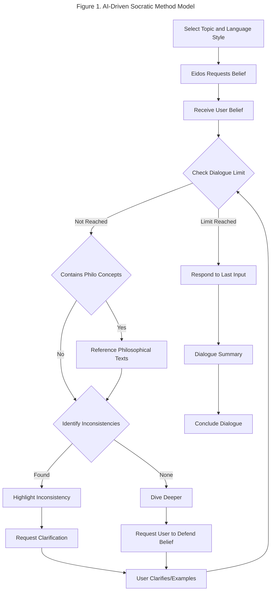

# Enhancing Philosophical Inquiry with AI-Driven Socratic Dialogues

## Abstract

Eidos is a web application developed to engage students in philosophical inquiry through AI-driven Socratic dialogues. This study evaluates Eidos' effectiveness in encouraging students to examine their beliefs and explore alternative perspectives. The development of Eidos centered around using a large language model to facilitate conversations that simulate the Socratic questioning technique. The application integrates a database of philosophical texts to avoid sharing unsupported claims and instead provide accurate and reliable information.

The evaluation involved high school and college students who provided feedback through a mixed-methods approach, including Likert-scale, multiple-choice questions, and open-ended responses. This assessment focused on Eidos' impact on students' critical thinking skills and openness to different viewpoints. Results showed a strong positive reception among students, who appreciated the dialogues for enhancing their ability to engage with their beliefs carefully. Participants also emphasized how they became more reflective on the foundations of their beliefs after using Eidos. However, feedback also highlighted the need to improve the Eidos' ability to handle complex beliefs and sensitive topics.

The findings suggest that Eidos has significant potential to enhance philosophical education by adapting to diverse student backgrounds, making philosophical inquiry accessible and engaging for all. The study also underscores the importance of refining AI capabilities to complement the efforts made by educators.

## Introduction

### The Socratic Method in Education

The Socratic method is a dialectical approach to inquiry that follows a question-and-answer format (Soccio 104). Demonstrated by Socrates in Plato's dialogues, this method was a tool for engaging Athenians to challenge their own beliefs. It aims to assess the coherence and support of a belief system (Benson 6). The process generally involves three steps: first, the individual presents a belief; then, Socrates asks questions to examine the belief's depth and implications; finally, both parties refine the belief to achieve a justified and coherent understanding. This iterative questioning and refining process encourages individuals to not just hold beliefs but to understand the reasoning behind them.

Employing the method has proven to significantly enhance critical thinking skills in diverse educational settings. For example, Socratic seminars provide students with a platform for intellectual analysis to avoid taking statements at face value (Acim 49). The method's focus on logic and clarity further improves analytical abilities when combined with practical learning exercises (Ho et al. 14). It has also been shown to boost communication skills, making students more confident in expressing their thoughts (Dalim et al. 1039). In addition, it was found that students value thought-provoking questions more than teachers realize, suggesting that the Socratic method should not be abandoned (Abou-Hanna et al. 114). All of these findings highlight the method's role in encouraging learners to question assumptions and engage deeply with content.

However, applying the Socratic method in different educational settings presents challenges. For instance, in language teaching and science education, obstacles such as teachers' lack of content knowledge and questioning skills have been identified (Dalim et al., 1040). These challenges underline the importance of professional training for teachers to effectively use the Socratic method. Without skilled teachers, students may feel intimidated that they resist learning (Crogman 70). Additionally, extra support must be provided as the method's success partly depends on the students' background knowledge and vocabulary (Copelin 4-5; Chan & Zahar 8). When thoughtfully applied, the Socratic method has the power to transform learning experiences.

### Overcoming Limitations through Artificial Intelligence

Eidos innovates artificial intelligence (AI) to enhance the Socratic method's application in education. This tool is crafted to complement teachers by adapting to diverse student backgrounds, ultimately aiming to make philosophical inquiry accessible and engaging for all. Eidos addresses three challenges: it uses natural language processing (NLP) to generate relevant responses, overcoming limitations in teachers' questioning skills; it offers customization options to cater to individual learning preferences, ensuring a broader inclusivity; and it uses a structured approach to identify inconsistencies in students' beliefs, promoting critical thinking and self-reflection. Through these measures, Eidos provides a platform where students can prepare to tackle the modern world through philosophical inquiry.

At the core of Eidos is OpenAI's GPT-4, a large language model (LLM) that excels in generating context-aware, human-like text. This technology is made possible by recent advancements in NLP that allow LLMs to understand nuanced language patterns (Devlin 2; Vaswani 5). Its proficiency in various NLP tasks such as question-answering and information extraction makes it a powerful tool for educational applications (Kalyan 13, 26; Dijkstra 4; MacNeil 37). Additionally, GPT-4's knowledge from its extensive training data allows it to identify internal contradictions and logical fallacies in students' claims, providing opportunity to improve their logical coherence. However, its limitations, such as reasoning errors and producing inaccurate content, require further solutions from Eidos (Achiam et al. 46).

Prompt engineering, a technique in using LLMs, is embraced to fine-tune Eidos' behavior. This technique provides the LLM with the most appropriate instruction for solving the task at hand (Liu et al. 22). By prompting the LLM to generate responses in a step-by-step manner, Eidos can mitigate the risk of making reasoning errors. Prompt engineering is also applied to adapt Eidos' questioning style with the students' learning preferences. For example, LLMs can be prompted to generate responses that uses standard English instead of academic-level language to cater to students with different language proficiency levels. Effective adoption of this technique requires experimentation with different prompt patterns such as role playing, chain-of-thought, and template filling (White et al., 4).

The tendency of LLMs to provide false information is addressed by retrieval-augmented generation (RAG), a technique that bridges knowledge gap by incorporating a database of external information (Gao et al. 2). In Eidos, publicly available articles from the Stanford Encyclopedia of Philosophy (SEP) is used to ground the factuality of the LLM's responses. This approach allows the model to avoid sharing unsupported claims and instead provide accurate and reliable information. Furthermore, Eidos cross-references the user's belief with the SEP articles to identify external contradictions to established philosophical knowledge. This process ensures that the user's belief is consistent with commonly accepted truths and encourages them to refine their understanding.

The subsequent sections of this paper will detail the design, development, and evaluation of Eidos, providing an in-depth analysis of its methodology and application. By addressing the design choices, development processes, and evaluation methods, this examination aims to illuminate the transformative potential of Eidos in overcoming the traditional challenges associated with the Socratic method. The significance of this study lies not only in its immediate impact on enhancing educational technology but also in its broader implications for the future of philosophical inquiry, offering a forward-looking perspective on how technology can enrich critical thinking and dialogic learning in the digital age.

## Methods

### Modelling the Socratic Method

Formal models for integrating the Socratic Method into computational systems have been explored, highlighting its use in developing dialogue systems. One study Caminada aims to formalize argumentations similar to the Socratic method, where the objective is to derive contradictions from an opponent's premises (Camida 111). Another approach uses state diagrams to formalize the method into three steps: eliciting examples, identifying attributes, and abstracting these into general principles (Huse & Le 184-188). While Eidos also uses state diagrams to formalize the Socratic method, it diverges by focusing on detecting inconsistencies within a belief statement.

The formal model for implementing Eidos outlines a structured process that uses AI to simulate Socratic dialogues. Before initiating the dialogue, the user selects a topic and language style to personalize the conversation. Eidos then requests the user to state a belief, which serves as the starting point for the dialogue. The system processes the user's input to determine if it contains philosophical concepts. If it does, Eidos references a database of SEP articles to ground the discussion in established knowledge. This retrieval-augmented generation (RAG) technique ensures that the dialogue is informed by credible sources.

After determining whether to fetch external references, Eidos identifies inconsistencies within the user's belief statement. If inconsistencies are found, the system highlights them to the user and requests clarification or examples to resolve the contradictions. An inconsistency is determined using three criteria: internal contradiction, logical fallacy, and factual inaccuracy. The first two are detected by the AI model's reasoning capabilities, while the third is cross-referenced with the SEP database. This iterative process of questioning and clarifying continues until a dialogue limit is reached, at which point Eidos provides a summary of the dialogue and concludes the session. A limit is set considering the expense of computational resources and the user's attention span.

The dialogue management leverages state machine concepts, where the dialogue progresses through a series of states (e.g., receiving beliefs, checking for philosophical concepts, identifying inconsistencies) based on the user's input and the system's assessments. This structured approach facilitates a focused and coherent exploration of beliefs, mimicking the iterative, deep-diving nature of the Socratic method.
